<h1>Using the application</h1>

<!-- Login Page -->
<h2>1. Login Page</h2>

  When the application initially starts, it will send to Login page of
  AlphaVoting.

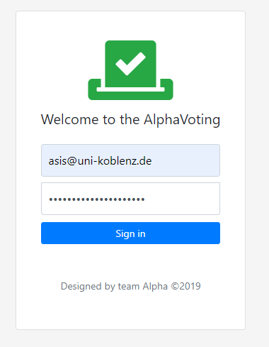

  After successful login, you will be sent to organizer page (as default)
  dashboard.

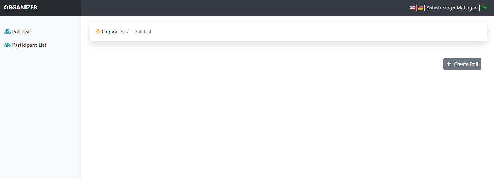

<!-- Participant List -->
<h2>2. Participant List (Add)</h2>

  As an organizer, Here you can add new participant list by clicking on Create
  Participant List.

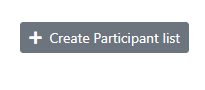

  After, adding participant list and their email (like below):

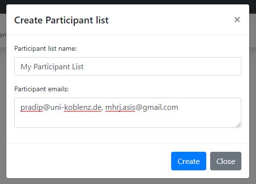

Now, You will see details in dashboard:

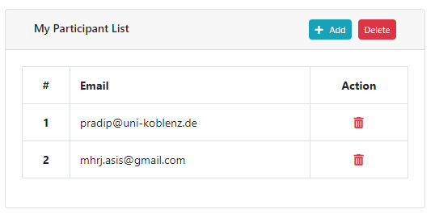

  Note: Action here are:

<ol>
  <li>
    You can Add further Participant
  </li>
  <li>
    You can Delete existing participant
  </li>
</ol>

<!-- Poll List -->
<h2>3. Poll List</h2>

  In this section you can create a poll list, by clicking on:

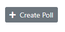

  After clicking on Create Poll, you will get modal pop up for Poll details

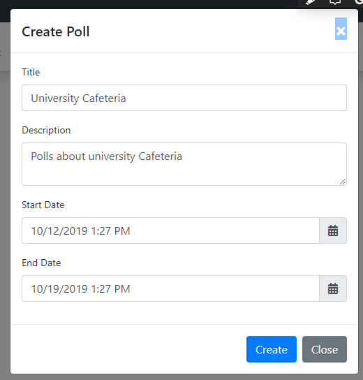

  There are four states to be considered according to requirements, which are:

<ol>
  <li>Prepared</li>
  <li>Prepared</li>
  <li>Prepared</li>
  <li>Prepared</li>
</ol>
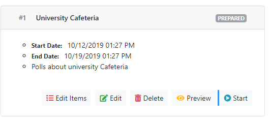

  So, when Poll(s) are created there are several things to be considered
  (figure: 1.2.x):

<ol>
  <li>Information: E.g. Start Date, End Date and its description</li>
  <li>Organizer can Edit Items</li>
  <li>Organizer can Edit Poll</li>
  <li>Organizer can Delete Poll</li>
  <li>Organizer can Preview Poll</li>
  <li>And Finally organizer can Start Poll</li>
</ol>

  <b>Edit Items:</b>  
  After clicking on Edit Items, you will get the following page:

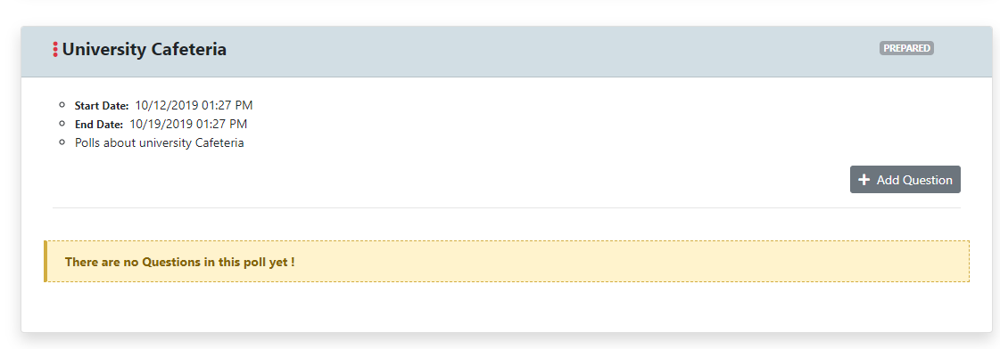

  Now, you will be able to add a question or multiple questions, by clicking on
  Add Question

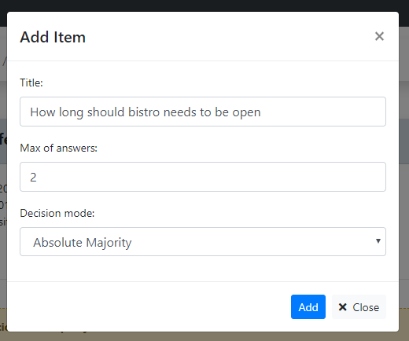

<!-- Components -->
<h2>Components and Features</h2>
<ol>
  <!-- 1 -->
  <li>
    Responsive (Suitable for Mobile, Tablet and Desktop) screen:
  </li>
  

    The application is responsive which means the application is suitable for
    mobile screen, tablet screen and desktop screen. For e.g.
  

  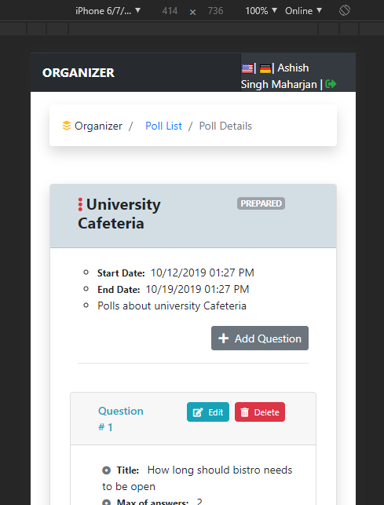

  <!-- 2 -->
  <li>Breadcrumb navigation:</li>
  

    for ease of use, we have provided navigation as breadcrumb component
  

  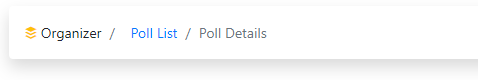

  <!-- 3 -->
  <li>
    Multi-Language option:
  </li>
  

    As a part of project requirement, administrator / organizer can view
    dashboard and its content in multi language (English and Deutsch).
  

  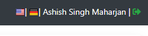
</ol>
